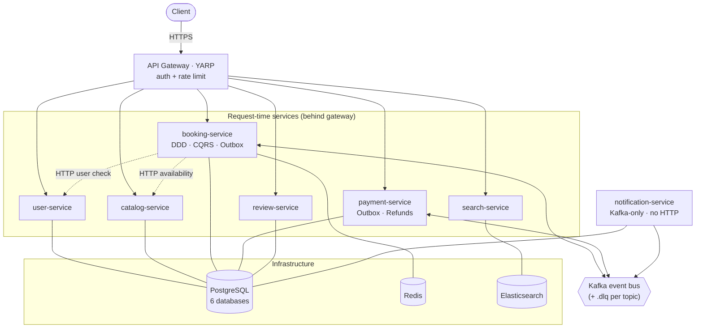
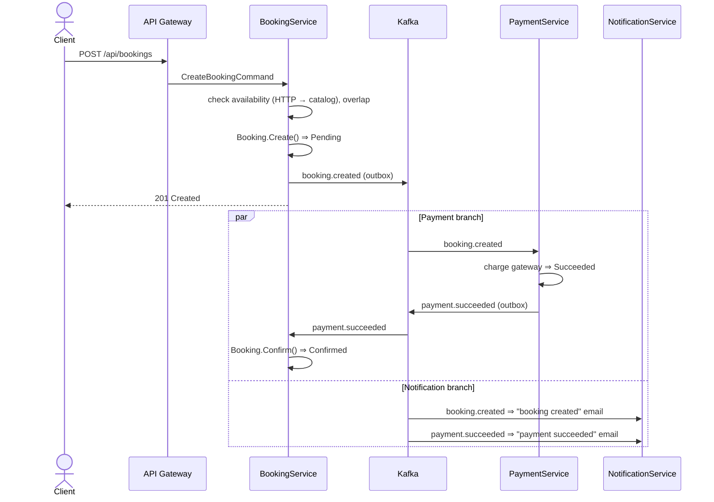
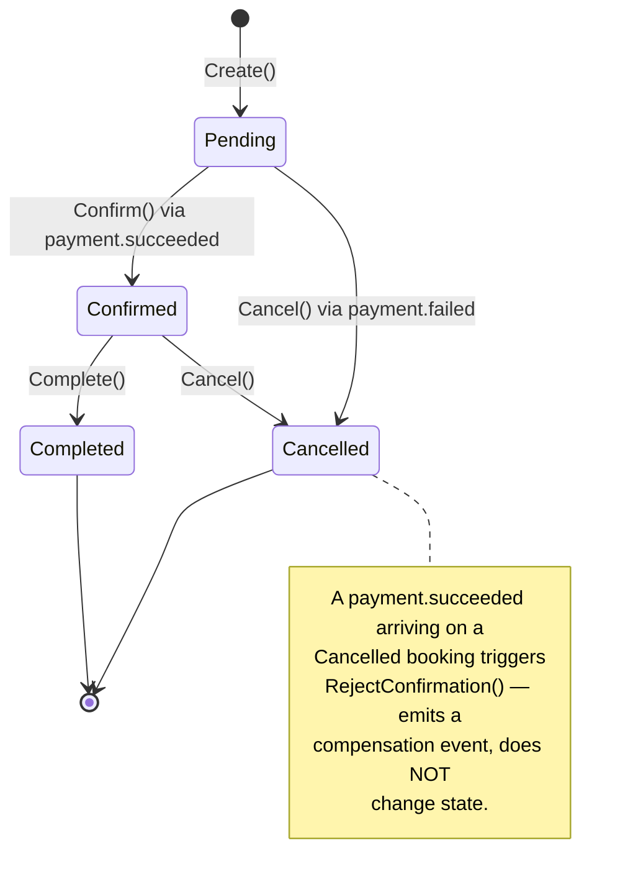
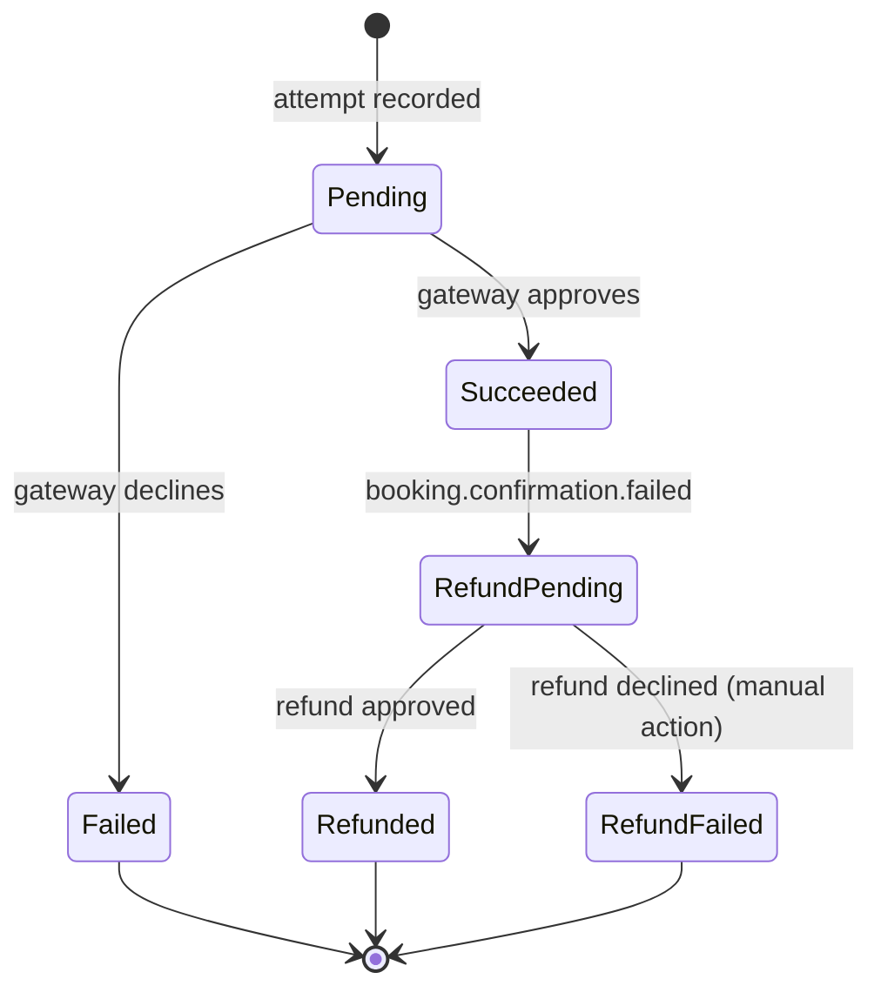

[](https://github.com/phatnguyentit/bookingsystem-microservice/actions/workflows/cicd.yml)
[](https://github.com/phatnguyentit/bookingsystem-microservice/actions/workflows/codeql.yml)
[](https://github.com/phatnguyentit/bookingsystem-microservice/actions/workflows/cicd.yml)
[](https://github.com/phatnguyentit/bookingsystem-microservice/actions/workflows/generate-issues.yml)
# Booking System Microservice

A .NET 10 microservices booking platform demonstrating CQRS, DDD, a Kafka-choreographed
payment saga (with the transactional **outbox**, dead-letter queues, and durable refunds), and
.NET Aspire orchestration.

---

## Tech Stack

| Layer | Technology |
|---|---|
| Runtime | .NET 10, C# |
| Orchestration | .NET Aspire 9+ |
| API Gateway | YARP (reverse proxy, JWT auth, rate limiting) |
| Services | ASP.NET Core Minimal API |
| ORM | Entity Framework Core 10 |
| CQRS | MediatR |
| Database | PostgreSQL (per-service) |
| Cache / Lock | Redis (distributed cache + Redlock) |
| Messaging | Kafka (Confluent.Kafka) |
| Search | Elasticsearch |
| Observability | OpenTelemetry (traces, metrics, logs) |

---

## Architecture

Seven independent services sit behind a YARP API gateway and are orchestrated with .NET Aspire.
Only **BookingService** calls other services synchronously (HTTP, at request time); everything else
is **event-driven choreography** over Kafka.



### Service map

| Route (via gateway) | Service | Store | Auth | Kafka role |
|---|---|---|---|---|
| `/api/users` | user-service | `userdb` | required | — |
| `/api/catalog` | catalog-service | `catalogdb` | — | — |
| `/api/bookings` | booking-service | `bookingdb` | required | producer + consumer |
| `/api/payments` | payment-service | `paymentdb` | required | producer + consumer |
| `/api/search` | search-service | Elasticsearch | — | — |
| `/api/reviews` | review-service | `reviewdb` | — | — |
| _(none — Kafka only)_ | notification-service | `notifdb` | — | consumer |

> In `Development` the gateway uses a pass-through auth handler — no real JWT is needed locally.
> JWT bearer validation is only enforced outside Development.

### Key patterns

- **Database-per-Service** — isolated PostgreSQL databases (`userdb`, `catalogdb`, `bookingdb`, `paymentdb`, `notifdb`, `reviewdb`); no service reads another's DB.
- **CQRS via MediatR** — commands and queries separated across all services.
- **DDD on BookingService** — aggregate root, value objects (`Money`, `DateRange`, `BookingId`, `CatalogId`, `UserId`), domain events, repository pattern (the only 4-layer service).
- **Event-Driven Choreography (Saga)** — no central orchestrator; services react to Kafka integration events independently.
- **Transactional Outbox** — BookingService **and** PaymentService write domain/integration events to an `outbox_messages` table in the *same transaction* as the state change; a background `OutboxProcessor` publishes them to Kafka, so the DB and the event stream can never diverge.
- **At-least-once + idempotent consumers** — `KafkaConsumerBase` commits offsets manually, retries transient failures with backoff, and parks poison/exhausted messages in a per-topic `.dlq`. Handlers are idempotent (duplicate `payment.succeeded` on a confirmed booking is a no-op).
- **Durable refund compensation** — if a payment is captured but its booking can't be confirmed, `RefundProcessor` reconciles the refund obligation to completion, retrying transient gateway failures indefinitely (a refund is never dead-lettered).
- **Distributed Locking** — Redis locks on `lock:listing:{id}:{date}` guard against double-booking.
- **Resilience** — `StandardResilienceHandler` (retry, circuit breaker, timeout) on all HTTP clients.
- **Service Discovery** — .NET Aspire DNS-based; no hardcoded ports.

---

## The Booking ↔ Payment Saga

The core workflow is a choreographed saga across **BookingService**, **PaymentService**, and
**NotificationService**. The happy path:



**Payment declined** instead: PaymentService publishes `payment.failed`; BookingService consumes it
and runs `Booking.Cancel(reason)` ⇒ `Cancelled`; NotificationService emails the failure.

**Saga conflict** (payment captured but the booking is already `Cancelled`): BookingService emits
`booking.confirmation.failed`; PaymentService records a durable `RefundPending` obligation that
`RefundProcessor` drives to `Refunded`.

See [docs/booking-saga-scenarios.md](docs/booking-saga-scenarios.md) for all six scenarios
(idempotent redelivery, saga conflict/refund, failure classification, edge cases).

### Booking state machine



### Payment state machine



---

## Kafka topics

Every business topic is provisioned in `AppHost/Program.cs` with a matching `<topic>.dlq`
dead-letter topic. Consumer group ids follow `{service}-{topic}`.

| Topic | Producer | Consumer(s) | Reaction |
|---|---|---|---|
| `booking.created` | BookingService | PaymentService, NotificationService | start payment / email |
| `booking.cancelled` | BookingService | NotificationService | email |
| `booking.confirmation.failed` | BookingService | PaymentService | start refund |
| `payment.succeeded` | PaymentService | BookingService, NotificationService | confirm booking / email |
| `payment.failed` | PaymentService | BookingService, NotificationService | cancel booking / email |
| `payment.refunded` | PaymentService | _(no consumer yet)_ | — |
| `payment.refund.failed` | PaymentService | _(no consumer — operator alert)_ | manual refund |

> Not yet wired: `catalog.availability.updated` (CatalogService has no producer) and a
> SearchService consumer to populate the Elasticsearch index. See the module notes in
> [.claude/rules/modules/](.claude/rules/modules/).

---

## Solution Structure

```
src/
├── Orchestration/BookingSystem.AppHost/       # .NET Aspire host (infra + services + Kafka topics)
├── ServiceDefaults/BookingSystem.ServiceDefaults/
├── Gateway/BookingSystem.ApiGateway/          # YARP
├── Shared/
│   ├── BookingSystem.Shared.Contracts/        # integration events, DTOs, KafkaTopics
│   ├── BookingSystem.Shared.Messaging/        # KafkaConsumerBase, publisher, settings
│   ├── BookingSystem.Shared.Persistence/      # MigrateWithRetryAsync
│   └── BookingSystem.Shared.CrossCutting/     # design-time connection-string resolution
└── Services/
    ├── UserService/                           # Pattern B (2-layer)
    ├── CatalogService/                        # Pattern B
    ├── BookingService/                        # Pattern A — Domain / Application / Infrastructure / Api
    ├── PaymentService/                        # Pattern B + outbox, refund processor, mock gateway
    ├── NotificationService/                   # Pattern B, Kafka-only (no HTTP)
    ├── SearchService/                         # Pattern B, Elasticsearch
    └── ReviewService/                         # Pattern B

tests/                                         # one project per service + Shared.Messaging.Tests
docker/
└── docker-compose.infra.yml                   # Kafka, Redis, Postgres, Elasticsearch
```

Two solution files live at the root: `BookingSystem.slnx` (source projects) and
`BookingSystem.Tests.slnx` (test projects). Build the source solution; run tests against the test
solution.

---

## Getting Started

### Prerequisites

- [.NET 10 SDK](https://dotnet.microsoft.com/download)
- Docker Desktop
- .NET Aspire workload

```bash
dotnet workload install aspire
dotnet tool install --global dotnet-ef
```

### Run everything (services + infra) via Aspire

```bash
git clone https://github.com/phatnguyentit/bookingsystem-microservice.git
cd bookingsystem-microservice
dotnet restore

cd src/Orchestration/BookingSystem.AppHost
dotnet run
# Aspire dashboard: https://localhost:15888
```

### Infrastructure only (without Aspire)

```bash
docker compose -f docker/docker-compose.infra.yml up -d
```

### Build & test

```bash
dotnet build BookingSystem.slnx
dotnet test  BookingSystem.Tests.slnx
```

### Migrations

Run from each service's Infrastructure project (bring infra up first so the design-time connection
string resolves). Every service with a database has migrations: Booking, Catalog, Payment,
Notification, User, Review.

```bash
dotnet ef migrations add <Name> \
  --project src/Services/BookingService/BookingSystem.BookingService.Infrastructure
dotnet ef database update \
  --project src/Services/BookingService/BookingSystem.BookingService.Infrastructure
```

Auto-migration on boot is controlled by `RunMigrationsOnStartup` in each service's `appsettings.json`.

---

## Docs

- [Architecture & Design Patterns](docs/architecture-patterns.md) — patterns, event flow, reliability model, diagrams
- [Booking System Guide](docs/booking-system-guide.md) — full solution walkthrough
- [Booking Saga Scenarios](docs/booking-saga-scenarios.md) — end-to-end saga behaviour & failure handling
</content>
</invoke>
