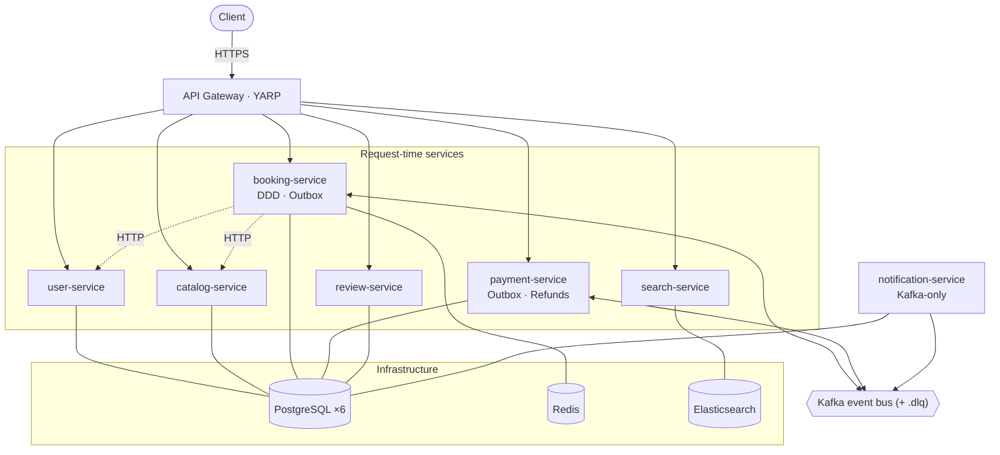
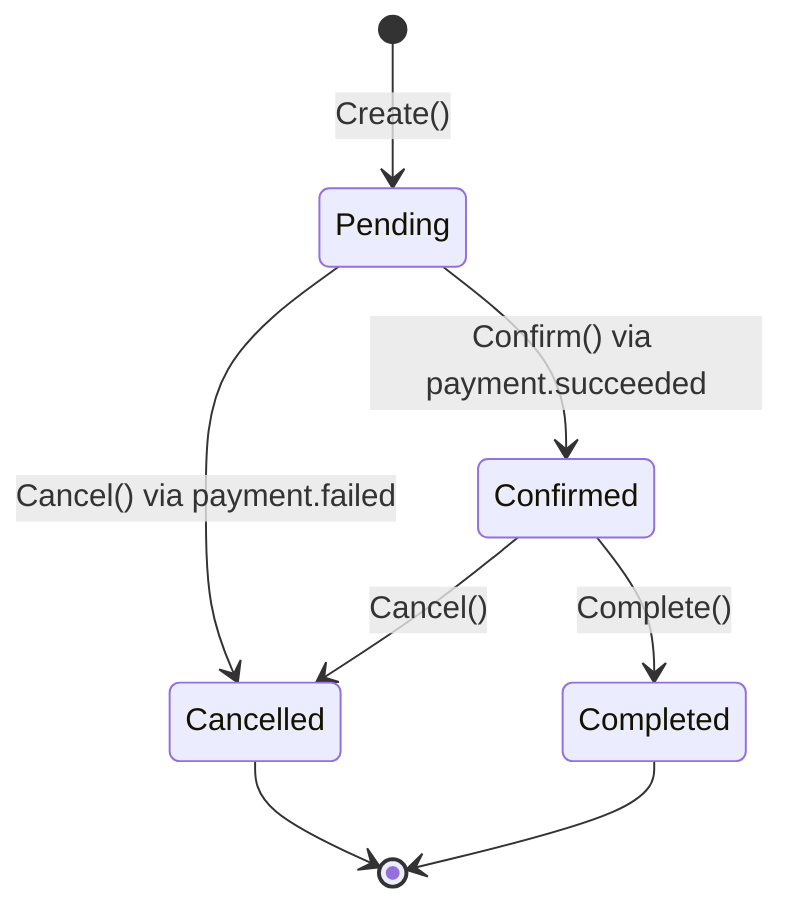
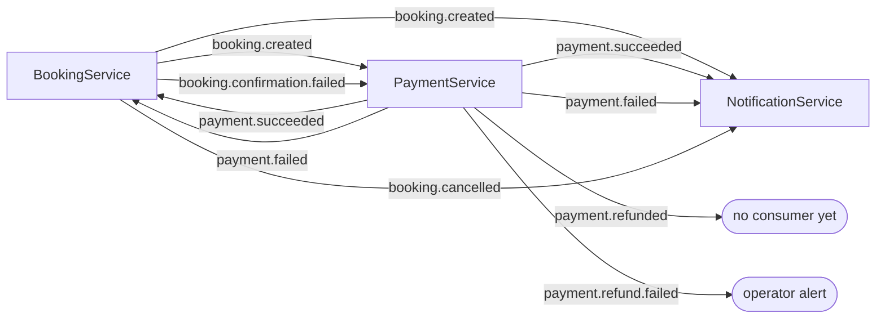
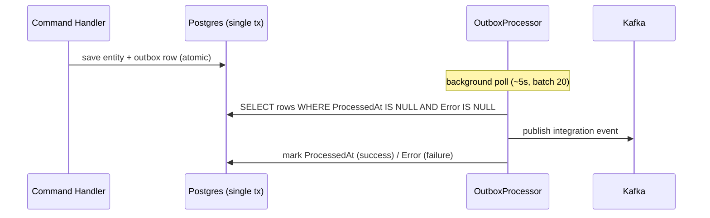
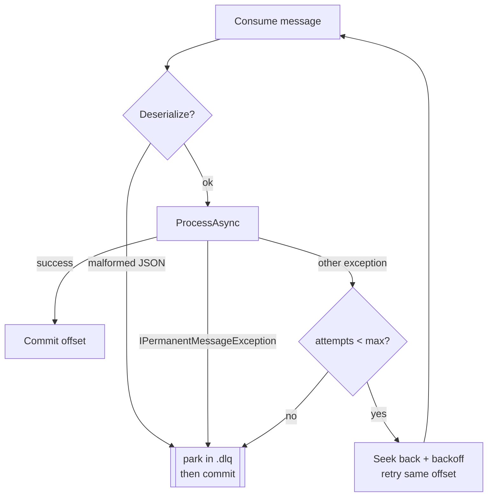

# Architecture & Design Patterns

Design patterns and reliability model of the `bookingsystem-microservice` solution.

---

## System overview



---

## Core architectural patterns

| Pattern | Location | Notes |
|---|---|---|
| **API Gateway** | `src/Gateway/BookingSystem.ApiGateway/` | YARP reverse proxy; JWT bearer (non-Development) or a pass-through `AuthHandler` (Development); fixed-window rate limiter (100 req/min) registered |
| **Database per Microservice** | `src/Orchestration/BookingSystem.AppHost/Program.cs` | Six PostgreSQL DBs (`userdb`, `catalogdb`, `bookingdb`, `paymentdb`, `notifdb`, `reviewdb`); no service reads another's DB |
| **Event-Driven / Choreography (Saga)** | `src/Shared/BookingSystem.Shared.Messaging/` + each service's `Consumers/` | Kafka async communication; services react to integration events independently — no central orchestrator |
| **Transactional Outbox** | `BookingService.Infrastructure/Outbox/`, `PaymentService.Infrastructure/Outbox/` | Events staged in the same DB transaction as the state change, then relayed to Kafka by a background processor |
| **Service Discovery & Resilience** | `src/ServiceDefaults/BookingSystem.ServiceDefaults/Extensions.cs` | Aspire DNS-based discovery; `StandardResilienceHandler` on all HTTP clients |

---

## Domain-Driven Design — `BookingService`

`BookingService` is the only 4-layer Clean Architecture service (Domain → Application →
Infrastructure → Api); every other service is a 2-layer vertical slice.

| Pattern | Location |
|---|---|
| **Aggregate Root** | `Domain/Aggregates/Booking.cs` — state machine `Pending → Confirmed → Completed`, or `→ Cancelled` |
| **Value Objects** | `Domain/ValueObjects/` — `Money`, `DateRange`, and strongly-typed IDs `BookingId`, `CatalogId`, `UserId` |
| **Domain Events** | `Domain/Events/` — `BookingCreatedEvent`, `BookingConfirmedEvent`, `BookingCancelledEvent`, `BookingConfirmationFailedEvent` |
| **Repository Pattern** | `IBookingRepository` (Domain) → `BookingRepository` (Infrastructure/EF Core) |
| **Unit of Work + Outbox** | `Infrastructure/Messaging/UnitOfWork.cs` — serializes aggregate domain events into `outbox_messages` and saves atomically |



> `RejectConfirmation(reason)` is raised when a captured payment lands on a booking that is no longer
> `Pending`. It does **not** change `Status`; it only emits `BookingConfirmationFailedEvent` so a
> refund can be choreographed downstream.

---

## Application layer patterns

| Pattern | Location |
|---|---|
| **CQRS** | Commands (`CreateBookingCommand`, `CancelBookingCommand`, `ConfirmBookingCommand`) and Queries (`GetBookingQuery`) separated via MediatR — applied across all services |
| **Mediator** | MediatR `ISender`/`IPublisher` for request routing and domain-event dispatch |
| **Idempotent handlers** | e.g. `ConfirmBookingHandler` treats a redelivered `payment.succeeded` on an already-`Confirmed` booking as a no-op |

---

## Infrastructure patterns

| Pattern | Location |
|---|---|
| **Event Publishing** | `Shared.Messaging/KafkaEventPublisher.cs` — Confluent.Kafka, JSON serialized |
| **Outbox Relay** | `OutboxProcessor` / `PaymentOutboxProcessor` — poll unprocessed rows (~5 s, batch 20), publish, mark processed |
| **Reliable Consumers** | `Shared.Messaging/KafkaConsumerBase.cs` — manual offset commit, bounded retry, dead-letter |
| **Refund Reconciler** | `PaymentService/Refunds/RefundProcessor.cs` — drives durable `RefundPending` obligations to completion |
| **Payment Gateway Abstraction** | `PaymentService.Infrastructure/Gateway/` — `IPaymentGateway` + `MockPaymentGateway` (always approves; swap for a real gateway) |
| **Distributed Cache / Lock** | Redis via `AddRedisDistributedCache()`; `lock:listing:{id}:{date}` for double-booking |
| **Full-Text Search** | `SearchService/Infrastructure/Search/ElasticsearchService.cs` — Elasticsearch with pagination (date/price filters are accepted but not yet applied) |
| **Observability** | OpenTelemetry (traces + metrics + logs) via ServiceDefaults |

---

## Event choreography

Every arrow is a Kafka topic. Each topic also has a `<topic>.dlq` provisioned in `AppHost`.



| Topic | Producer | Consumer(s) |
|---|---|---|
| `booking.created` | BookingService (outbox) | PaymentService, NotificationService |
| `booking.cancelled` | BookingService (outbox) | NotificationService |
| `booking.confirmation.failed` | BookingService (outbox) | PaymentService |
| `payment.succeeded` | PaymentService (outbox) | BookingService, NotificationService |
| `payment.failed` | PaymentService (outbox) | BookingService, NotificationService |
| `payment.refunded` | PaymentService (outbox) | _(none yet)_ |
| `payment.refund.failed` | PaymentService (outbox) | _(none — operator alert)_ |

---

## Outbox pattern

Producers never publish to Kafka inline. They stage an `OutboxMessage` in the **same transaction**
as the state change, so a crash between "DB committed" and "event published" cannot lose the event.



`BookingService.UnitOfWork` collects domain events from the `ChangeTracker` and serializes them to
the outbox; `PaymentService` handlers stage integration events directly.

---

## Consumer reliability

`KafkaConsumerBase<T>` consumes with **manual commit** so an offset only advances after successful
processing. It classifies failures and never lets a failed message's offset get leapfrogged.



| Failure | Example | Behaviour |
|---|---|---|
| **Transient** | DB blip, network error | Seek back + retry up to `maxAttempts` (default 3, exponential backoff); then dead-letter |
| **Permanent (poison)** | `NotFoundException` (`: IPermanentMessageException`), malformed JSON | Skip the retry budget → dead-letter immediately → commit |
| **Business compensation** | payment captured, booking unconfirmable | Not an exception — handler emits a compensation event and returns; offset committed |

**Refund exception:** a refund obligation is a financial debt, so it is **never** dead-lettered.
`RefundPaymentHandler` records a durable `RefundPending` state and `RefundProcessor` retries transient
gateway failures indefinitely; only a *permanent* gateway decline moves it to `RefundFailed` and
raises an operator alert.

---

## Inter-service communication

**Synchronous (HTTP)** — only from BookingService, at request time, via typed `HttpClient` with
Aspire service discovery + `StandardResilienceHandler`:

- `CatalogServiceClient` → `GET /api/catalog/catalogs/{id}` (verify listing exists / available)
- `UserServiceClient` → `GET /api/users/{id}` (registered; not currently called by `CreateBookingHandler`)

**Asynchronous (Kafka)** — all other cross-service communication (see the choreography diagram above).

---

## What's implemented vs. open follow-ups

### Implemented
- **Choreography-based Saga** — booking ↔ payment ↔ notification, driven entirely by Kafka events (this is the "saga" in the repo's design).
- **Transactional Outbox** — in both BookingService and PaymentService; the DB state and event stream cannot diverge.
- **Dead-letter queues + failure classification** — transient retry vs. permanent poison vs. business compensation.
- **Durable refund compensation** — `RefundProcessor` reconciles `RefundPending` obligations; refunds are never dropped.
- **Idempotent consumers** — safe against at-least-once redelivery.
- **Clean Architecture** on BookingService; vertical slices elsewhere.

### Open follow-ups
| Gap | Notes |
|---|---|
| No consumer for `payment.refunded` | No "you've been refunded" email yet |
| No consumer for `payment.refund.failed` | Operator alert is a `LogCritical` only — no ticketing/ops workflow |
| No consumer for `booking.cancelled` beyond email | e.g. CatalogService does not release availability |
| `catalog.availability.updated` not wired | CatalogService publishes no Kafka events; SearchService's index is never populated automatically |
| SearchService filters | `checkIn` / `checkOut` / `maxPrice` accepted but not applied to the Elasticsearch query |
| Refund observability | `RefundFailed` / stuck-refund signals are logs only — OpenTelemetry counters are deferred (see `TODO(metrics)` in `RefundProcessor`) |
| Integration tests | Testcontainers-based saga tests not yet added |
```
