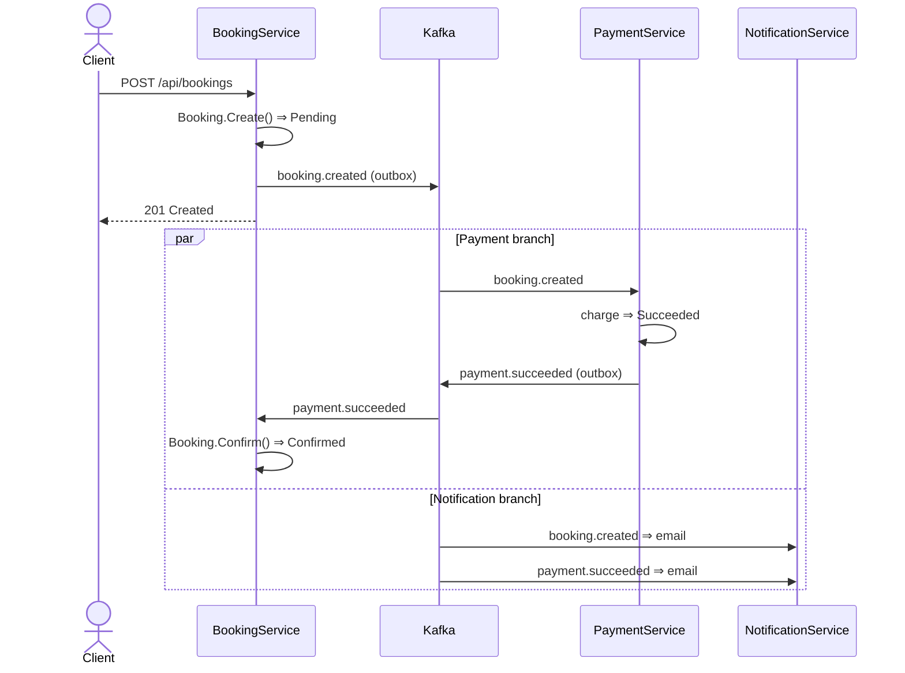

# Booking System — Microservice Architecture (.NET 10)

> Full solution walkthrough using .NET Aspire, YARP API Gateway, and DDD on BookingService.
>
> **Scope note:** the code snippets below are illustrative of the shape of each layer and may be
> simplified relative to the source. For the authoritative, up-to-date design — including the Kafka
> **outbox**, dead-letter queues, and the refund saga — see
> [architecture-patterns.md](architecture-patterns.md) and
> [booking-saga-scenarios.md](booking-saga-scenarios.md).

---

## Table of Contents

1. [Solution Structure](#1-solution-structure)
2. [Aspire Orchestration](#2-aspire-orchestration)
3. [API Gateway (YARP)](#3-api-gateway-yarp)
4. [Core Services](#4-core-services)
5. [BookingService — DDD Design](#5-bookingservice--domain-driven-design)
6. [Shared Infrastructure](#6-shared-infrastructure)
7. [Inter-Service Communication](#7-inter-service-communication)
8. [Database Setup](#8-database-setup)
9. [Running the Solution](#9-running-the-solution)

---

## 1. Solution Structure

```
BookingSystem/
│
├── BookingSystem.sln
│
├── src/
│   │
│   ├── Orchestration/
│   │   └── BookingSystem.AppHost/          # .NET Aspire Host
│   │       ├── BookingSystem.AppHost.csproj
│   │       └── Program.cs
│   │
│   ├── ServiceDefaults/
│   │   └── BookingSystem.ServiceDefaults/  # Shared Aspire defaults
│   │       ├── BookingSystem.ServiceDefaults.csproj
│   │       └── Extensions.cs
│   │
│   ├── Gateway/
│   │   └── BookingSystem.ApiGateway/       # YARP reverse proxy
│   │       ├── BookingSystem.ApiGateway.csproj
│   │       ├── Program.cs
│   │       └── appsettings.json
│   │
│   ├── Services/
│   │   ├── UserService/
│   │   │   ├── BookingSystem.UserService.Api/
│   │   │   └── BookingSystem.UserService.Infrastructure/
│   │   │
│   │   ├── CatalogService/
│   │   │   ├── BookingSystem.CatalogService.Api/
│   │   │   └── BookingSystem.CatalogService.Infrastructure/
│   │   │
│   │   ├── BookingService/                 # DDD structured
│   │   │   ├── BookingSystem.BookingService.Api/
│   │   │   ├── BookingSystem.BookingService.Domain/
│   │   │   ├── BookingSystem.BookingService.Application/
│   │   │   └── BookingSystem.BookingService.Infrastructure/
│   │   │
│   │   ├── PaymentService/
│   │   │   ├── BookingSystem.PaymentService.Api/
│   │   │   └── BookingSystem.PaymentService.Infrastructure/
│   │   │
│   │   ├── NotificationService/
│   │   │   ├── BookingSystem.NotificationService.Api/
│   │   │   └── BookingSystem.NotificationService.Infrastructure/
│   │   │
│   │   ├── SearchService/
│   │   │   ├── BookingSystem.SearchService.Api/
│   │   │   └── BookingSystem.SearchService.Infrastructure/
│   │   │
│   │   └── ReviewService/
│   │       ├── BookingSystem.ReviewService.Api/
│   │       └── BookingSystem.ReviewService.Infrastructure/
│   │
│   └── Shared/
│       ├── BookingSystem.Shared.Contracts/  # Events, DTOs, proto files
│       └── BookingSystem.Shared.Messaging/  # Kafka/RabbitMQ abstractions
│
└── docker/
    ├── docker-compose.infra.yml             # Kafka, Redis, Postgres, Elasticsearch
    └── .env
```

---

## 2. Aspire Orchestration

### 2.1 AppHost Project

**`BookingSystem.AppHost.csproj`**
```xml
<Project Sdk="Microsoft.NET.Sdk">
  <PropertyGroup>
    <OutputType>Exe</OutputType>
    <TargetFramework>net10.0</TargetFramework>
    <IsAspireHost>true</IsAspireHost>
  </PropertyGroup>

  <ItemGroup>
    <PackageReference Include="Aspire.Hosting.AppHost" Version="9.*" />
    <PackageReference Include="Aspire.Hosting.Kafka" Version="9.*" />
    <PackageReference Include="Aspire.Hosting.Redis" Version="9.*" />
    <PackageReference Include="Aspire.Hosting.PostgreSQL" Version="9.*" />
    <PackageReference Include="Aspire.Hosting.Elasticsearch" Version="9.*" />
    <PackageReference Include="Aspire.Hosting.Docker" Version="9.*" />
  </ItemGroup>

  <ItemGroup>
    <!-- Reference all service projects -->
    <ProjectReference Include="../Gateway/BookingSystem.ApiGateway/BookingSystem.ApiGateway.csproj" />
    <ProjectReference Include="../Services/UserService/BookingSystem.UserService.Api/BookingSystem.UserService.Api.csproj" />
    <ProjectReference Include="../Services/CatalogService/BookingSystem.CatalogService.Api/BookingSystem.CatalogService.Api.csproj" />
    <ProjectReference Include="../Services/BookingService/BookingSystem.BookingService.Api/BookingSystem.BookingService.Api.csproj" />
    <ProjectReference Include="../Services/PaymentService/BookingSystem.PaymentService.Api/BookingSystem.PaymentService.Api.csproj" />
    <ProjectReference Include="../Services/NotificationService/BookingSystem.NotificationService.Api/BookingSystem.NotificationService.Api.csproj" />
    <ProjectReference Include="../Services/SearchService/BookingSystem.SearchService.Api/BookingSystem.SearchService.Api.csproj" />
    <ProjectReference Include="../Services/ReviewService/BookingSystem.ReviewService.Api/BookingSystem.ReviewService.Api.csproj" />
  </ItemGroup>
</Project>
```

**`Program.cs`**
```csharp
var builder = DistributedApplication.CreateBuilder(args);

// --- Infrastructure ---
var postgres   = builder.AddPostgres("postgres").WithPgAdmin();
var redis      = builder.AddRedis("redis").WithRedisCommander();
var kafka      = builder.AddKafka("kafka").WithKafkaUI();
var elastic    = builder.AddElasticsearch("elasticsearch");

// --- Databases (one per service) ---
var userDb     = postgres.AddDatabase("userdb");
var catalogDb  = postgres.AddDatabase("catalogdb");
var bookingDb  = postgres.AddDatabase("bookingdb");
var paymentDb  = postgres.AddDatabase("paymentdb");
var notifDb    = postgres.AddDatabase("notifdb");

// --- Core Services ---
var userSvc = builder.AddProject<Projects.BookingSystem_UserService_Api>("user-service")
    .WithReference(userDb)
    .WithReference(redis);

var catalogSvc = builder.AddProject<Projects.BookingSystem_CatalogService_Api>("catalog-service")
    .WithReference(catalogDb)
    .WithReference(redis);

var bookingSvc = builder.AddProject<Projects.BookingSystem_BookingService_Api>("booking-service")
    .WithReference(bookingDb)
    .WithReference(redis)
    .WithReference(kafka)
    .WithReference(userSvc)
    .WithReference(catalogSvc);

var paymentSvc = builder.AddProject<Projects.BookingSystem_PaymentService_Api>("payment-service")
    .WithReference(paymentDb)
    .WithReference(kafka);

var notifSvc = builder.AddProject<Projects.BookingSystem_NotificationService_Api>("notification-service")
    .WithReference(notifDb)
    .WithReference(kafka)
    .WithReference(redis);

var searchSvc = builder.AddProject<Projects.BookingSystem_SearchService_Api>("search-service")
    .WithReference(elastic)
    .WithReference(redis)
    .WithReference(kafka);

var reviewSvc = builder.AddProject<Projects.BookingSystem_ReviewService_Api>("review-service")
    .WithReference(postgres.AddDatabase("reviewdb"))
    .WithReference(kafka);

// --- API Gateway ---
builder.AddProject<Projects.BookingSystem_ApiGateway>("api-gateway")
    .WithReference(userSvc)
    .WithReference(catalogSvc)
    .WithReference(bookingSvc)
    .WithReference(paymentSvc)
    .WithReference(searchSvc)
    .WithReference(reviewSvc)
    .WithExternalHttpEndpoints();

builder.Build().Run();
```

### 2.2 ServiceDefaults

**`Extensions.cs`** — Add this to every service `Program.cs` via `builder.AddServiceDefaults()`:
```csharp
public static class Extensions
{
    public static IHostApplicationBuilder AddServiceDefaults(this IHostApplicationBuilder builder)
    {
        builder.ConfigureOpenTelemetry();
        builder.AddDefaultHealthChecks();
        builder.Services.AddServiceDiscovery();
        builder.Services.ConfigureHttpClientDefaults(http =>
        {
            http.AddStandardResilienceHandler();
            http.AddServiceDiscovery();
        });
        return builder;
    }
}
```

---

## 3. API Gateway (YARP)

### 3.1 Project Setup

**`BookingSystem.ApiGateway.csproj`**
```xml
<Project Sdk="Microsoft.NET.Sdk.Web">
  <PropertyGroup>
    <TargetFramework>net10.0</TargetFramework>
  </PropertyGroup>
  <ItemGroup>
    <PackageReference Include="Yarp.ReverseProxy" Version="2.*" />
    <PackageReference Include="Microsoft.AspNetCore.Authentication.JwtBearer" Version="10.*" />
  </ItemGroup>
  <ItemGroup>
    <ProjectReference Include="../../../ServiceDefaults/BookingSystem.ServiceDefaults/BookingSystem.ServiceDefaults.csproj" />
  </ItemGroup>
</Project>
```

**`Program.cs`**
```csharp
var builder = WebApplication.CreateBuilder(args);

builder.AddServiceDefaults();

builder.Services
    .AddReverseProxy()
    .LoadFromConfig(builder.Configuration.GetSection("ReverseProxy"))
    .AddServiceDiscoveryDestinationResolver(); // resolves Aspire service names

builder.Services
    .AddAuthentication(JwtBearerDefaults.AuthenticationScheme)
    .AddJwtBearer();

builder.Services.AddAuthorization();

// Rate limiting
builder.Services.AddRateLimiter(options =>
{
    options.AddFixedWindowLimiter("global", o =>
    {
        o.PermitLimit = 100;
        o.Window = TimeSpan.FromMinutes(1);
    });
});

var app = builder.Build();

app.UseAuthentication();
app.UseAuthorization();
app.UseRateLimiter();
app.MapReverseProxy();
app.MapDefaultEndpoints();

app.Run();
```

**`appsettings.json`** — YARP route & cluster config:
```json
{
  "ReverseProxy": {
    "Routes": {
      "user-route": {
        "ClusterId": "user-cluster",
        "AuthorizationPolicy": "default",
        "Match": { "Path": "/api/users/{**catch-all}" }
      },
      "catalog-route": {
        "ClusterId": "catalog-cluster",
        "Match": { "Path": "/api/catalog/{**catch-all}" }
      },
      "booking-route": {
        "ClusterId": "booking-cluster",
        "AuthorizationPolicy": "default",
        "Match": { "Path": "/api/bookings/{**catch-all}" }
      },
      "payment-route": {
        "ClusterId": "payment-cluster",
        "AuthorizationPolicy": "default",
        "Match": { "Path": "/api/payments/{**catch-all}" }
      },
      "search-route": {
        "ClusterId": "search-cluster",
        "Match": { "Path": "/api/search/{**catch-all}" }
      },
      "review-route": {
        "ClusterId": "review-cluster",
        "Match": { "Path": "/api/reviews/{**catch-all}" }
      }
    },
    "Clusters": {
      "user-cluster":    { "Destinations": { "d1": { "Address": "http://user-service" } } },
      "catalog-cluster": { "Destinations": { "d1": { "Address": "http://catalog-service" } } },
      "booking-cluster": { "Destinations": { "d1": { "Address": "http://booking-service" } } },
      "payment-cluster": { "Destinations": { "d1": { "Address": "http://payment-service" } } },
      "search-cluster":  { "Destinations": { "d1": { "Address": "http://search-service" } } },
      "review-cluster":  { "Destinations": { "d1": { "Address": "http://review-service" } } }
    }
  }
}
```

> **Note:** Service addresses (`http://user-service`, etc.) are resolved by Aspire's built-in service discovery — no hardcoded ports needed.

---

## 4. Core Services

Each service (except BookingService) follows the same minimal vertical-slice pattern:

```
BookingSystem.{Name}Service.Api/
├── Program.cs
├── Endpoints/
│   └── {Resource}Endpoints.cs      # Minimal API endpoint groups
├── Features/
│   ├── GetById/
│   │   ├── GetByIdQuery.cs
│   │   └── GetByIdHandler.cs
│   └── Create/
│       ├── CreateCommand.cs
│       └── CreateHandler.cs
└── appsettings.json

BookingSystem.{Name}Service.Infrastructure/
├── Persistence/
│   ├── {Name}DbContext.cs
│   └── Migrations/
└── Repositories/
```

**Typical `Program.cs` for a simple service:**
```csharp
var builder = WebApplication.CreateBuilder(args);
builder.AddServiceDefaults();

// EF Core + PostgreSQL via Aspire connection string
builder.AddNpgsqlDbContext<UserDbContext>("userdb");

// Redis cache
builder.AddRedisDistributedCache("redis");

// MediatR for CQRS
builder.Services.AddMediatR(cfg =>
    cfg.RegisterServicesFromAssembly(typeof(Program).Assembly));

var app = builder.Build();
app.MapDefaultEndpoints();
app.MapUserEndpoints();   // extension method registering route group
app.Run();
```

---

## 5. BookingService — Domain-Driven Design

### 5.1 Layer Overview

```
BookingSystem.BookingService.Domain/          <- Pure domain, no dependencies
BookingSystem.BookingService.Application/     <- Use cases (CQRS + MediatR)
BookingSystem.BookingService.Infrastructure/  <- EF Core, Kafka, HTTP clients
BookingSystem.BookingService.Api/             <- Minimal API entry point
```

### 5.2 Domain Layer

**Aggregates, Entities, Value Objects — no framework references.**

```csharp
// Domain/Aggregates/Booking.cs
public class Booking : AggregateRoot<BookingId>
{
    public UserId UserId { get; private set; }
    public CatalogId CatalogId { get; private set; }
    public DateRange Period { get; private set; }
    public Money TotalPrice { get; private set; }
    public BookingStatus Status { get; private set; }

    private Booking() { } // EF constructor

    public static Booking Create(
        UserId userId,
        CatalogId catalogId,
        DateRange period,
        Money totalPrice)
    {
        var booking = new Booking
        {
            Id = BookingId.New(),
            UserId = userId,
            CatalogId = catalogId,
            Period = period,
            TotalPrice = totalPrice,
            Status = BookingStatus.Pending
        };
        booking.AddDomainEvent(new BookingCreatedEvent(booking.Id, userId, catalogId));
        return booking;
    }

    public void Confirm()
    {
        if (Status != BookingStatus.Pending)
            throw new BookingDomainException("Only pending bookings can be confirmed.");
        Status = BookingStatus.Confirmed;
        AddDomainEvent(new BookingConfirmedEvent(Id));
    }

    public void Cancel(string reason)
    {
        if (Status == BookingStatus.Cancelled)
            throw new BookingDomainException("Booking is already cancelled.");
        Status = BookingStatus.Cancelled;
        AddDomainEvent(new BookingCancelledEvent(Id, reason));
    }
}
```

```csharp
// Domain/ValueObjects/DateRange.cs
public record DateRange
{
    public DateOnly CheckIn { get; }
    public DateOnly CheckOut { get; }

    public DateRange(DateOnly checkIn, DateOnly checkOut)
    {
        if (checkOut <= checkIn)
            throw new BookingDomainException("CheckOut must be after CheckIn.");
        CheckIn = checkIn;
        CheckOut = checkOut;
    }

    public int Nights => CheckOut.DayNumber - CheckIn.DayNumber;
}

// Domain/ValueObjects/Money.cs
public record Money(decimal Amount, string Currency)
{
    public Money Add(Money other)
    {
        if (Currency != other.Currency)
            throw new BookingDomainException("Cannot add different currencies.");
        return new Money(Amount + other.Amount, Currency);
    }
}

// Domain/ValueObjects/BookingId.cs
public record BookingId(Guid Value)
{
    public static BookingId New() => new(Guid.NewGuid());
}
```

```csharp
// Domain/Events/BookingCreatedEvent.cs
public record BookingCreatedEvent(
    BookingId BookingId,
    UserId UserId,
    CatalogId CatalogId) : IDomainEvent;

// Domain/Exceptions/BookingDomainException.cs
public class BookingDomainException(string message) : Exception(message);
```

```csharp
// Domain/Repositories/IBookingRepository.cs
public interface IBookingRepository
{
    Task<Booking?> GetByIdAsync(BookingId id, CancellationToken ct = default);
    Task AddAsync(Booking booking, CancellationToken ct = default);
    Task<bool> HasOverlapAsync(CatalogId catalogId, DateRange period, CancellationToken ct = default);
}
```

### 5.3 Application Layer

```csharp
// Application/Commands/CreateBooking/CreateBookingCommand.cs
public record CreateBookingCommand(
    Guid UserId,
    Guid CatalogId,
    DateOnly CheckIn,
    DateOnly CheckOut) : IRequest<BookingId>;

// Application/Commands/CreateBooking/CreateBookingHandler.cs
public class CreateBookingHandler(
    IBookingRepository bookingRepo,
    ICatalogServiceClient catalogClient,
    IUserServiceClient userClient,
    IUnitOfWork unitOfWork) : IRequestHandler<CreateBookingCommand, BookingId>
{
    public async Task<BookingId> Handle(CreateBookingCommand cmd, CancellationToken ct)
    {
        var period = new DateRange(cmd.CheckIn, cmd.CheckOut);

        // Sync call: check availability via CatalogService
        var catalog = await catalogClient.GetCatalogAsync(cmd.CatalogId, ct)
            ?? throw new NotFoundException($"Catalog {cmd.CatalogId} not found.");

        if (!catalog.IsAvailable(period))
            throw new CatalogNotAvailableException(cmd.CatalogId, period);

        // Check for overlapping bookings in own DB
        if (await bookingRepo.HasOverlapAsync(new CatalogId(cmd.CatalogId), period, ct))
            throw new BookingOverlapException();

        var totalPrice = catalog.CalculatePrice(period);

        var booking = Booking.Create(
            new UserId(cmd.UserId),
            new CatalogId(cmd.CatalogId),
            period,
            totalPrice);

        await bookingRepo.AddAsync(booking, ct);
        await unitOfWork.CommitAsync(ct); // dispatches domain events

        return booking.Id;
    }
}
```

```csharp
// Application/Queries/GetBooking/GetBookingQuery.cs
public record GetBookingQuery(Guid BookingId) : IRequest<BookingDto>;

public class GetBookingHandler(IBookingRepository repo)
    : IRequestHandler<GetBookingQuery, BookingDto>
{
    public async Task<BookingDto> Handle(GetBookingQuery q, CancellationToken ct)
    {
        var booking = await repo.GetByIdAsync(new BookingId(q.BookingId), ct)
            ?? throw new NotFoundException($"Booking {q.BookingId} not found.");

        return new BookingDto(
            booking.Id.Value,
            booking.UserId.Value,
            booking.CatalogId.Value,
            booking.Period.CheckIn,
            booking.Period.CheckOut,
            booking.TotalPrice.Amount,
            booking.TotalPrice.Currency,
            booking.Status.ToString());
    }
}
```

### 5.4 Infrastructure Layer

```csharp
// Infrastructure/Persistence/BookingDbContext.cs
public class BookingDbContext(DbContextOptions<BookingDbContext> options)
    : DbContext(options)
{
    public DbSet<Booking> Bookings => Set<Booking>();

    protected override void OnModelCreating(ModelBuilder mb)
    {
        mb.ApplyConfigurationsFromAssembly(typeof(BookingDbContext).Assembly);
    }
}

// Infrastructure/Persistence/Configurations/BookingConfiguration.cs
public class BookingConfiguration : IEntityTypeConfiguration<Booking>
{
    public void Configure(EntityTypeBuilder<Booking> builder)
    {
        builder.HasKey(b => b.Id);
        builder.Property(b => b.Id)
            .HasConversion(id => id.Value, v => new BookingId(v));

        builder.OwnsOne(b => b.Period, p =>
        {
            p.Property(x => x.CheckIn).HasColumnName("check_in");
            p.Property(x => x.CheckOut).HasColumnName("check_out");
        });

        builder.OwnsOne(b => b.TotalPrice, m =>
        {
            m.Property(x => x.Amount).HasColumnName("price_amount");
            m.Property(x => x.Currency).HasColumnName("price_currency");
        });

        builder.Property(b => b.Status)
            .HasConversion<string>();
    }
}
```

The **transactional outbox** is implemented: `UnitOfWork.CommitAsync` serializes each aggregate's
domain events into `outbox_messages` rows and saves them in the *same* `SaveChangesAsync` as the
entity change, so persistence and messaging commit atomically. A background `OutboxProcessor`
(polling ~5 s, batch 20) later relays those rows to Kafka via MediatR, marking each row
`ProcessedAt` on success or `Error` on failure. Nothing is published to Kafka inline.

```csharp
// Infrastructure/Messaging/UnitOfWork.cs
public class UnitOfWork(BookingDbContext db) : IUnitOfWork
{
    public async Task CommitAsync(CancellationToken ct = default)
    {
        var aggregates = db.ChangeTracker.Entries<AggregateRoot>()
            .Where(e => e.Entity.DomainEvents.Count != 0)
            .ToList();

        foreach (var entry in aggregates)
        {
            foreach (var domainEvent in entry.Entity.DomainEvents)
                db.Set<OutboxMessage>().Add(OutboxMessage.For(domainEvent)); // staged, not published

            entry.Entity.ClearDomainEvents();
        }

        await db.SaveChangesAsync(ct); // entity change + outbox rows commit together
    }
}
```

See the reliability model (retry / dead-letter / refunds) in
[architecture-patterns.md](architecture-patterns.md#consumer-reliability).

### 5.5 API Layer

```csharp
// Api/Program.cs
var builder = WebApplication.CreateBuilder(args);
builder.AddServiceDefaults();
builder.AddNpgsqlDbContext<BookingDbContext>("bookingdb");
builder.AddRedisDistributedCache("redis");

builder.Services.AddMediatR(cfg =>
{
    cfg.RegisterServicesFromAssembly(typeof(CreateBookingCommand).Assembly);
    cfg.RegisterServicesFromAssembly(typeof(Program).Assembly);
});

builder.Services.AddScoped<IBookingRepository, BookingRepository>();
builder.Services.AddScoped<IUnitOfWork, UnitOfWork>();

// HTTP clients for sync calls (resolved by Aspire service discovery)
builder.Services.AddHttpClient<ICatalogServiceClient, CatalogServiceClient>(
    c => c.BaseAddress = new Uri("http://catalog-service"));
builder.Services.AddHttpClient<IUserServiceClient, UserServiceClient>(
    c => c.BaseAddress = new Uri("http://user-service"));

// Kafka producer
builder.Services.AddSingleton<IKafkaProducer, KafkaProducer>();

var app = builder.Build();
app.MapDefaultEndpoints();
app.MapBookingEndpoints();
app.Run();

// Api/Endpoints/BookingEndpoints.cs
public static class BookingEndpoints
{
    public static void MapBookingEndpoints(this WebApplication app)
    {
        var group = app.MapGroup("/api/bookings").RequireAuthorization();

        group.MapPost("/", async (CreateBookingCommand cmd, ISender sender) =>
        {
            var id = await sender.Send(cmd);
            return Results.Created($"/api/bookings/{id.Value}", new { id = id.Value });
        });

        group.MapGet("/{id:guid}", async (Guid id, ISender sender) =>
        {
            var dto = await sender.Send(new GetBookingQuery(id));
            return Results.Ok(dto);
        });

        group.MapDelete("/{id:guid}", async (Guid id, string reason, ISender sender) =>
        {
            await sender.Send(new CancelBookingCommand(id, reason));
            return Results.NoContent();
        });
    }
}
```

---

## 6. Shared Infrastructure

### 6.1 Shared Contracts

```
BookingSystem.Shared.Contracts/
├── Events/
│   ├── BookingCreatedIntegrationEvent.cs
│   ├── BookingCancelledIntegrationEvent.cs
│   ├── PaymentSucceededIntegrationEvent.cs
│   └── PaymentFailedIntegrationEvent.cs
└── DTOs/
    ├── BookingDto.cs
    └── CatalogDto.cs
```

```csharp
// Shared.Contracts/Events/BookingCreatedIntegrationEvent.cs
public record BookingCreatedIntegrationEvent(
    Guid BookingId,
    Guid UserId,
    Guid CatalogId,
    DateOnly CheckIn,
    DateOnly CheckOut,
    decimal Amount,
    string Currency,
    DateTimeOffset OccurredAt);
```

### 6.2 Kafka Topics

Topic names are constants in `Shared.Contracts/Events/KafkaTopics.cs`. Each business topic is
provisioned in `AppHost/Program.cs` with a matching `<topic>.dlq` dead-letter topic.

| Topic | Producer | Consumers |
|---|---|---|
| `booking.created` | BookingService | PaymentService, NotificationService |
| `booking.cancelled` | BookingService | NotificationService |
| `booking.confirmation.failed` | BookingService | PaymentService |
| `payment.succeeded` | PaymentService | BookingService, NotificationService |
| `payment.failed` | PaymentService | BookingService, NotificationService |
| `payment.refunded` | PaymentService | _(no consumer yet)_ |
| `payment.refund.failed` | PaymentService | _(no consumer — operator alert)_ |

> `catalog.availability.updated` is referenced in older design notes but is **not** wired:
> CatalogService currently publishes no Kafka events.

---

## 7. Inter-Service Communication

The booking workflow is a Kafka-choreographed saga. Happy path:



Full failure/compensation handling (declined payment, saga conflict, refunds, redelivery) is in
[booking-saga-scenarios.md](booking-saga-scenarios.md).

### 7.1 Synchronous (HTTP)

Only BookingService makes request-time calls to other services, via typed `HttpClient`s resolved by
Aspire service discovery. (gRPC and message-broker alternatives like RabbitMQ are **not** part of
the current implementation — Kafka is the sole async transport.)

```csharp
// BookingService calling CatalogService via typed HTTP client
public class CatalogServiceClient(HttpClient http) : ICatalogServiceClient
{
    public async Task<CatalogDto?> GetCatalogAsync(Guid catalogId, CancellationToken ct)
        => await http.GetFromJsonAsync<CatalogDto>($"/api/catalog/catalogs/{catalogId}", ct);
}
```

### 7.2 Asynchronous (Kafka)

```csharp
// Shared.Messaging/IEventPublisher.cs
public interface IEventPublisher
{
    Task PublishAsync<T>(string topic, T @event, CancellationToken ct = default)
        where T : class;
}

// BookingService producer notification handler
public class PublishBookingCreatedHandler(IEventPublisher publisher)
    : INotificationHandler<BookingCreatedEvent>
{
    public Task Handle(BookingCreatedEvent notification, CancellationToken ct)
        => publisher.PublishAsync("booking.created",
            new BookingCreatedIntegrationEvent(
                notification.BookingId.Value,
                notification.UserId.Value,
                notification.CatalogId.Value,
                // ... map fields
                DateTimeOffset.UtcNow), ct);
}

// NotificationService consumer
public class BookingCreatedConsumer(INotificationSender sender)
    : IConsumer<BookingCreatedIntegrationEvent>
{
    public async Task Consume(ConsumeContext<BookingCreatedIntegrationEvent> context)
    {
        await sender.SendEmailAsync(
            context.Message.UserId,
            $"Your booking {context.Message.BookingId} is confirmed!");
    }
}
```

---

## 8. Database Setup

### 8.1 Per-Service Databases (PostgreSQL)

Each service runs its own migrations independently:

```bash
# From each service's Infrastructure project
dotnet ef migrations add InitialCreate --project BookingSystem.BookingService.Infrastructure
dotnet ef database update
```

### 8.2 Redis Usage Per Service

Each service owns its own Redis key namespace (see `.claude/rules/database.md`):

| Service | Redis Key Pattern | TTL | Purpose |
|---|---|---|---|
| BookingService | `lock:catalog:{id}:{date}` | 30 sec | Distributed lock (double-booking prevention) |
| CatalogService | `catalog:{id}` | 5 min | Availability cache |
| SearchService | `search:{hash}` | 2 min | Query result cache |
| UserService | `user:{id}:profile` | 10 min | Profile cache |

### 8.3 Infrastructure Docker Compose (for local dev without Aspire)

**`docker/docker-compose.infra.yml`**
```yaml
services:
  postgres:
    image: postgres:17
    environment:
      POSTGRES_USER: booking
      POSTGRES_PASSWORD: booking123
    ports: ["5432:5432"]
    volumes: ["pgdata:/var/lib/postgresql/data"]

  redis:
    image: redis:7-alpine
    ports: ["6379:6379"]

  kafka:
    image: confluentinc/cp-kafka:7.7.0
    environment:
      KAFKA_PROCESS_ROLES: broker,controller
      KAFKA_NODE_ID: 1
      KAFKA_LISTENERS: PLAINTEXT://:9092,CONTROLLER://:9093
      KAFKA_ADVERTISED_LISTENERS: PLAINTEXT://localhost:9092
      KAFKA_CONTROLLER_QUORUM_VOTERS: 1@kafka:9093
      KAFKA_CONTROLLER_LISTENER_NAMES: CONTROLLER
      KAFKA_OFFSETS_TOPIC_REPLICATION_FACTOR: 1
      CLUSTER_ID: "MkU3OEVBNTcwNTJENDM2Qk"
    ports: ["9092:9092"]

  elasticsearch:
    image: elasticsearch:8.15.0
    environment:
      discovery.type: single-node
      xpack.security.enabled: "false"
    ports: ["9200:9200"]

volumes:
  pgdata:
```

---

## 9. Running the Solution

### Prerequisites

```bash
# Install .NET 10 SDK
# Install .NET Aspire workload
dotnet workload install aspire

# Install EF Core tools
dotnet tool install --global dotnet-ef
```

### Steps

```bash
# 1. Clone and restore
git clone https://github.com/your-org/booking-system.git
cd booking-system
dotnet restore

# 2. Run the Aspire AppHost (starts all services + infra via Docker)
cd src/Orchestration/BookingSystem.AppHost
dotnet run

# Aspire dashboard available at: https://localhost:15888
# API Gateway available at:      https://localhost:5000
```

### VS Code Workspace

Create `.vscode/launch.json` to launch Aspire directly:
```json
{
  "version": "0.2.0",
  "configurations": [
    {
      "name": "Launch Aspire AppHost",
      "type": "coreclr",
      "request": "launch",
      "program": "${workspaceFolder}/src/Orchestration/BookingSystem.AppHost/bin/Debug/net10.0/BookingSystem.AppHost.dll",
      "cwd": "${workspaceFolder}/src/Orchestration/BookingSystem.AppHost",
      "stopAtEntry": false,
      "env": {
        "ASPNETCORE_ENVIRONMENT": "Development"
      }
    }
  ]
}
```

### Create the solution file

```bash
# Run from repo root to wire up all projects
dotnet new sln -n BookingSystem
find src -name "*.csproj" | xargs -I {} dotnet sln add {}
```

---

## Key Technology Decisions

| Concern | Choice | Reason |
|---|---|---|
| Orchestration | .NET Aspire + Docker | Service discovery, health checks, telemetry out of the box |
| API Gateway | YARP | Native .NET, config-driven routing, JWT middleware |
| Sync comms | REST (typed `HttpClient`) | Request-time calls from BookingService only; gRPC considered but not used |
| Async comms | Kafka | Fan-out integration events with an outbox producer + dead-letter consumers |
| Reliability | Transactional outbox + DLQ + refund reconciler | No lost events; at-least-once with idempotent, retrying consumers |
| ORM | EF Core 10 | Per-service DbContext, migrations, owned value objects |
| Cache / Lock | Redis | Distributed cache + Redlock for booking concurrency |
| Search | Elasticsearch | Full-text search over catalogs |
| Architecture | DDD on BookingService | Complex booking domain justifies aggregates + domain events |
| CQRS | MediatR | Clean separation of commands/queries per service |
